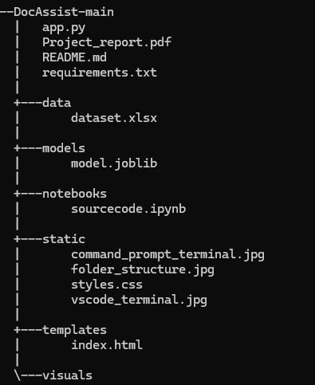

# DocAssist
A Machine Learning project that helps doctors detect whether patients need treatment or not based on the `Blood Analysis Dataset`.

# Project Setup and Execution

## Step 1: Clone the Repository or Download the ZIP

Clone the repository or download the ZIP file from the following Git link:
`https://github.com/Vishal4198/DocAssist`

## Step 2: Folder Structure

Ensure your project has the following folder structure:



## Step 3: Open and Run the Notebook

1. Open the `sourcecode.ipynb` file from the `notebooks` folder.
2. Run each cell in the Jupyter Notebook or VScode.

## Step 4: Trained Model Creation

After executing `sourcecode.ipynb`, the `model.joblib` file will be created inside the `models` folder, which is the trained model for this project.

## Step 5: Running the Flask App

### Using VS Code

1. Open the project in VS Code.
2. Locate `app.py`, which contains the Flask code for designing the user interface and uses HTML for webpage design.
3. Before running the `app.y` ensure `model.joblib` is present in the models directory and is updated.
4. Run `app.py` in VS Code.
5. The terminal at the bottom of the VS Code screen will show a local connection for the webpage.
6. Hold `Ctrl` + `click` to open the webpage in your default browser or you can copy and paste it your desired browser.
7. You can now see the user interface for entering the requested data. After inputting the data, click "Submit" to predict the output using the pre-trained model `model.joblib`.
8. Once you finish. `Ctrl` + `C` on the terminal to stop the application `app.py`.


### Using Command Prompt or PowerShell

1. Open the Command Prompt or PowerShell from the project folder.
2. Before running the `app.y` ensure `model.joblib` is present in the models directory and is updated.
3. Run the following command:
   ```sh
   python app.py
4. After running the command, a local connection link for the webpage will be displayed. Click on the link to open the webpage in your default browser or copy and paste it your desired browser. Input your data, and the output will be predicted using the pre-trained model.
5. Once done `Ctrl` + `C` on the terminal to stop the application `app.py`.


## Sample data for testing

### Male sample data
| HAEMATOCRIT | HAEMOGLOBINS | ERYTHROCYTE | LEUCOCYTE | THROMBOCYTE | MCH  | MCHC | MCV  | AGE | SEX |
|--------------|--------------|-------------|-----------|-------------|------|------|------|-----|-----|
| 48.5         | 16.5         | 5.63        | 8         | 299         | 29.3 | 34   | 86.1 | 29  | M   |
| 31.7         | 10.9         | 3.84        | 15.1      | 45          | 27.3 | 33.1 | 82.6 | 71  | M   |


### Female sample data
| HAEMATOCRIT | HAEMOGLOBINS | ERYTHROCYTE | LEUCOCYTE | THROMBOCYTE | MCH  | MCHC | MCV  | AGE | SEX |
|--------------|--------------|-------------|-----------|-------------|------|------|------|-----|-----|
| 35.4         | 11.9         | 3.9         | 5.3       | 243         | 30.5 | 33.6 | 90.8 | 35  | F   |
| 31.7         | 10.6         | 3.74        | 8.5       | 268         | 28.3 | 33.4 | 84.8 | 24  | F   |
